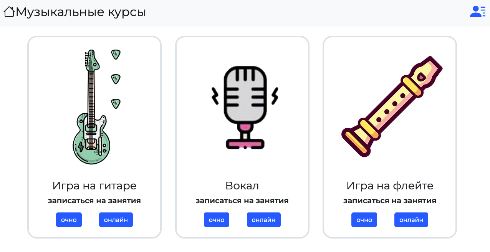

#YMA - youth musical association

Над проектом работали:

Алексей Яковлев - магазин билетов (./views/tickets)

Кармаев Андрей  - магазин курсов  (./views/courses)

Елецкая Любовь - магазин аксессуаров (./views/merch)

Полищук Павел - магазин техники, главная страница (./views/techs)

Каган Григорий - магазин инструментов (./views/tools)

Арсений - магазин носителей (./views/media)

##магазин курсов

Здесь можно научиться играть на разных музыкальных инструментах. На сайте есть регистрация, форма оплаты и многое другое... [посмотреть](https://alexeyyakovlev1.github.io/YMA/views/courses/index_coures.html)
